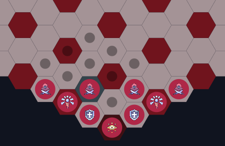

# Disputa dos Soberanos (Dispute of Sovereings)

**Número da Lista**: 33<br>
**Conteúdo da Disciplina**: Grafos 1<br>

## Alunos
|Matrícula | Aluno |
| -- | -- |
| 202046087  |  Fabrício Macedo de Queiroz |
| 202046004  |  Caio Moreira Sulz Gonsalves |

## Sobre 
O Disputa dos Soberanos é um jogo de tabuleiro, onde o jogador joga contra a \"CPU\". O tabuleiro conta com 270 casas dispostas em um tabuleiro hexagonal, com as casas alternando cores claras e escuras. Cada jogador começa com 9 peças: 1 Sentinela, 1 Atacante, 5 Escudos e 2 Conjuradores. Também vale ressaltar que as peças dos adversário ficam ocultas para o jogador.

É possível vencer o jogo de duas maneiras:

- A primeira, é eliminando a Sentinela do time adversário.

- A segunda, é percorrendo o tabuleiro levando a Sentinela até a casa da base inimiga.

A aplicação de grafos no projeto é observada nos seguintes pontos:
- O cálculo de movimentos possíveis de uma peça no tabuleiro, que varia de peça por peça;
- O cálculo do caminho mais curto da Sentinela até a base adversária, quando houver.
- A habilidade especial da Sentinela, um pulso que revela o local das peças adversárias no tabuleiro em um raio de 6 casas utilizando a BFS.

## Screenshots

<div style="text-align: center;">
  <p>Página Inicial</p>
  
</div>

<div style="text-align: center;">
  <p>Instruções</p>
  
</div>

<div style="text-align: center;">
  <p>Movimentação</p>
  
</div>

<div style="text-align: center;">
  <p>Sentinela Revelando</p>
  
</div>

<div style="text-align: center;">
  <p>Tabuleiro</p>
  
</div>

## Instalação 

<div style="text-align: left;">
  <p>
    <strong>Linguagem:</strong> Dart <br>
    <a href="https://skillicons.dev">
      
    </a>
  </p>
  <p>
    <strong>Framework:</strong> Flutter <br>
    <a href="https://skillicons.dev">
      
    </a>
  </p>
</div>


# Como Rodar a Build Web do Flutter Localmente

Este guia explica como rodar a build web do Flutter localmente usando Node.js. Siga as instruções abaixo para configurar o ambiente.

## Pré-requisitos

1. **Node.js e npm**: Certifique-se de que o [Node.js](https://nodejs.org/) está instalado. A instalação do Node.js inclui o npm (Node Package Manager), que também será necessário.
   - Verifique a instalação rodando:
     ```bash
     node -v
     npm -v
     ```

## Instruções para Rodar

### Web

1. **Download**:  Faça o Download do asset web-build.zip.

    Segue o link da [release](https://github.com/projeto-de-algoritmos-2024/Grafos1_Dispute-of-Sovereigns/releases), que também está dísponivel no github. 

<br>

2. **Extrair Arquivo ZIP**: Extraia o arquivo ZIP.

<br>

3. **Abra o Terminal**: Navegue até a pasta `web-build/web`, onde o arquivo `index.html` e outros arquivos de build estão localizados.

<br>

4. **Inicie o Servidor**:
   - Com o terminal ainda na pasta `web-build/web`, execute o comando:
     ```bash
     npx serve .
     ```
   - Isso inicia um servidor local e informa a porta onde foi aberto.

5. **Acesse o App no Navegador**:
   - Segurando a tecla CRTL, clique com o botão esquerdo no link do localhost.

### APK

1. **Download**:  Faça o Download do asset app-release.apk.

    Segue o link da [release](https://github.com/projeto-de-algoritmos-2024/Grafos1_Dispute-of-Sovereigns/releases), que também está dísponivel no github.

<br>

2. **Instalação**: Instale o arquivo APK em um dispositivo Android (Celular ou Emulador).


# Como Rodar o Projeto Web do Flutter Localmente

Este guia explica como rodar um projeto web do Flutter localmente usando Node.js. Siga as instruções abaixo para configurar o ambiente. A diferença entre rodar a build web e o projeto web é que a build web é o projeto já compilado, enquanto o projeto web é o código fonte do projeto.

## Pré-requisitos

1. Flutter SDK: Certifique-se de que o [Flutter SDK](https://docs.flutter.dev/get-started/install) está instalado.

2. Na tela de escolha do primeiro tipo de App, escolha a opção "Web", pois é a mais prática.

- Após a instalação, verifique se o Flutter está funcionando corretamente rodando:
  ```bash
  flutter doctor
  ```
O comando flutter doctor irá verificar se você possui todas as dependências necessárias para o desenvolvimento Flutter Web.

## Instruções para Rodar

1. **Clone o Repositório**: Clone o [repositório](https://github.com/projeto-de-algoritmos-2024/Grafos1_Dispute-of-Sovereigns) do projeto.

2. **Abra o Projeto**: Navegue até a pasta do projeto `Grafos1_Dispute-of-Sovereigns/dispute_of_sovereigns/`.

3. **Instale as Dependências**:
   - Com o terminal aberto na pasta do projeto, execute o comando:
     ```bash
     flutter pub get
     ```

4. **Inicie o Servidor**:
   - Com o terminal ainda na pasta do projeto, execute o comando:
     ```bash
     flutter run -d chrome
     ```
   - Isso inicia um servidor local e abre o projeto no navegador chrome, é possível utilizar outros navegadores.


## Uso 
- Tela inicial possui os botões Jogar e Instruções.
- Leia as Instruções

Na seção Jogar, existem duas telas principais: 
- Rota: Apresenta o caminho da Sentinela até a base adversária e as posições das peças.
- Partida: Onde você efetivamente irá jogar.

## Apresentação
[Vídeo de apresentação](https://youtu.be/D_QALLO1cx0)


## Outros 
Os códigos principais que implementam a lógica do projeto se encontram no diretório `dispute_of_sovereigns/lib`:
- No diretório `dispute_of_sovereigns/lib/pages` se encontra códigos relacionados ao front-end.
- No diretório `dispute_of_sovereigns/lib/models` se encontra códigos relacionados aos Grafos.
- No diretório `dispute_of_sovereigns/lib/helpers` se encontra códigos relacionados a ligação entre front-end e Grafos.


