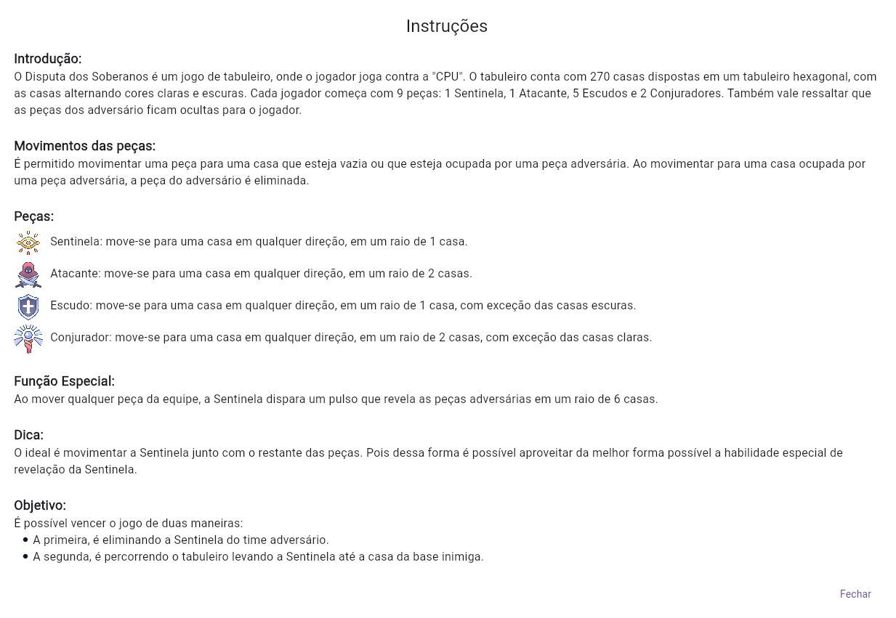

# Disputa dos Soberanos (Dispute of Sovereings)

**Número da Lista**: 33 
**Conteúdo da Disciplina**: Grafos 1 

## Alunos
|Matrícula | Aluno |
| -- | -- |
| 202046087  |  Fabrício Macedo de Queiroz |
| 202046004  |  Caio Moreira Sulz Gonsalves |

## Sobre 
Descreva os objetivos do seu projeto e como ele funciona. 

## Screenshots

  
Página Inicial

  

  
Instruções

  

  
Movimentação

  

  
Sentinela Revelando

  

  
Tabuleiro

  

## Instalação 

  

    <strong>Linguagem:</strong> Dart  
    
  

  

    <strong>Framework:</strong> Flutter  
    
  

Descreva os pré-requisitos para rodar o seu projeto e os comandos necessários.

## Uso 
Explique como usar seu projeto caso haja algum passo a passo após o comando de execução.

## Outros 
Quaisquer outras informações sobre seu projeto podem ser descritas abaixo.

